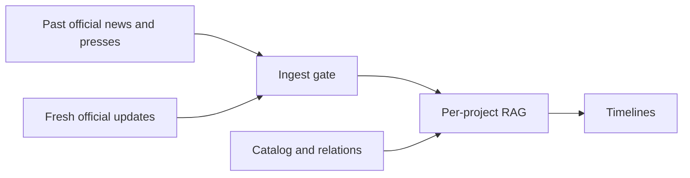

# Wannabe JAXA astronaut!

[日本語](./README.md)

Places **ongoing and planned national and commercial crewed** spaceflight programs (including astronaut-adjacent program names) on timelines from official sources only, and accumulates them into a project-scoped knowledge base (RAG). Typed relations between programs (partner / depends_on / successor) live in the human catalog.

For applications and official procedures, use each agency’s own pages.

Wiki study pages are a future track. Bodies are never auto-written.

## News and knowledge base

| | News | Knowledge base |
| --- | --- | --- |
| What it is | Events from official feeds and official X | Chunks of gated official text |
| Sources | Official distribution and posts | Allowlisted official URLs only |
| How to read | In each program’s chronological flow | As grounding for the same program |

Journalism is not a citation. Do not copy news text into wiki pages.

## Who it is for

Anyone following Japan-linked crewed programs and related international or commercial efforts from primary official sources. It is not an application desk and not a breaking-news outlet.

## Site

- Live site: https://wannabe-jaxa-astronaut.diaphana.io
- GitHub: https://github.com/tetra4rnav/wannabe-jaxa-astronaut

Developer specs live in [docs/](./docs/).
