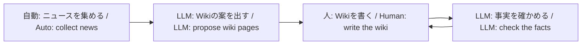

# Unofficial JAXA astronaut-applicant wiki

[日本語](./README.md)

This repository is **not an official site of JAXA, NASA, ESA, or any other space agency.** For applications and official procedures, use each agency’s own pages.

## Four-stage loop

## News and wiki

| | News | Wiki |
| --- | --- | --- |
| What it is | Events from official feeds and official X | Human-written study summaries |
| Sources | Official distribution and posts | Allowlisted official URLs only |
| How to read | Not only by recency—in the timeline of a program or project | Canonical pages by theme |
| LLM role | May help with collection | Proposes and audits only; does not write bodies |

The diagram is the relationship. News sparks work; the LLM proposes wiki pages; a person writes from official sources; the LLM checks facts. Do not copy news text into the wiki. Journalism is not a wiki source.

## Who it is for

A study site for people who want to become JAXA astronauts, and for anyone learning Japan’s human spaceflight from primary official sources. It is not an application desk and not a breaking-news outlet.

## Site

- Live site: https://wannabe-jaxa-astronaut.pages.dev
- GitHub: https://github.com/tetra4rnav/wannabe-jaxa-astronaut

To add wiki pages, write Markdown and cite official URLs. Steps are on [About](https://wannabe-jaxa-astronaut.pages.dev/about/).

Developer specs live in [docs/](./docs/).
