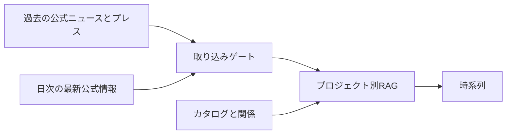

# Wannabe JAXA astronaut!

[English](./README.en.md)

進行中または計画中の **国・民間の有人宇宙飛行計画**（宇宙飛行士が関わる周辺の計画名を含む）を、公式情報源だけを使って時系列に置き、プロジェクト別の知識ベース（RAG）に積みます。計画どうしの関係（連携・依存・後継）もカタログで示します。

選抜応募や公式手続きは、各機関の公式ページを見てください。

Wiki の学習ページは将来計画です。本文の自動生成はしません。

## ニュースと知識ベース

| | ニュース | 知識ベース |
| --- | --- | --- |
| 中身 | 公式フィードや公式 X の出来事 | ゲートを通った公式テキストのチャンク |
| 出典 | 公式の配信・投稿を集める | 許可された公式 URL だけ |
| 読み方 | 計画ごとの時間の流れの中で読む | 同じ計画の根拠として検索・表示に使う |

報道は出典にしません。ニュースの文章を Wiki にコピーしません。

## 誰のためのサイトか

日本が参加する有人宇宙計画と、それに連なる国際・民間計画を、公式一次資料の時系列で追いたい人向けです。応募窓口でも、速報メディアでもありません。

## サイト

- 公開サイト: https://wannabe-jaxa-astronaut.diaphana.io
- GitHub: https://github.com/tetra4rnav/wannabe-jaxa-astronaut

開発者向けの仕様は [docs/](./docs/) を参照してください。
