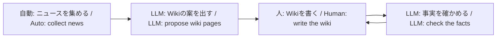

# JAXA宇宙飛行士志望Wiki（非公式）

[English](./README.en.md)

本リポジトリは **JAXA・NASA・ESA などの公式サイトではありません。** 選抜応募や公式手続きは、各機関の公式ページを見てください。

## 四つの段階

## ニュースと Wiki

| | ニュース | Wiki |
| --- | --- | --- |
| 中身 | 公式フィードや公式 X の出来事 | 人が書く学習用の要約 |
| 出典 | 公式の配信・投稿を集める | 許可された公式 URL だけ |
| 読み方 | 新しい順だけでなく、計画・事業の時間の流れの中で読む | テーマごとに整理された正本 |
| LLM | 集め方の一部に使うことがある | 案と監査だけ。本文は書かない |

関係は図のとおりです。ニュースがきっかけになり、LLM が Wiki の案を出し、人が公式資料で書き、LLM が事実を確かめます。ニュースの文章を Wiki にコピーしません。報道は Wiki の出典にしません。

## 誰のためのサイトか

JAXA 宇宙飛行士を志望する人、日本の有人宇宙開発を公式一次資料から学びたい人向けの学習用サイトです。応募窓口でも、速報メディアでもありません。

## サイト

- 公開サイト: https://wannabe-jaxa-astronaut.pages.dev
- GitHub: https://github.com/tetra4rnav/wannabe-jaxa-astronaut

Wiki を足すときは、公式ページの URL を出典に Markdown を書いてください。手順はサイトの [このサイトについて](https://wannabe-jaxa-astronaut.pages.dev/about/) にあります。

開発者向けの仕様は [docs/](./docs/) を参照してください。
