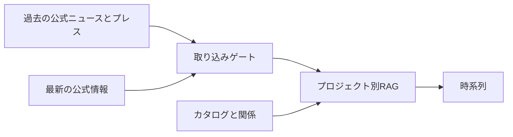

## 何をするか

国・民間の **有人宇宙飛行計画** と、宇宙飛行士が関わる周辺の **公式な計画名** だけをカタログに載せます。「月に社会を作る」のような主題はカタログの項目にしません。

## ニュースと知識ベース

| | ニュース | 知識ベース |
| --- | --- | --- |
| 中身 | 公式フィードや公式 X の出来事 | ゲートを通った公式テキスト |
| 出典 | 公式の配信・投稿 | 許可された公式 URL だけ |
| 読み方 | 計画ごとの時間の流れ | 同じ計画の根拠 |

ニュースの文章を Wiki にコピーしません。報道は出典にしません。

## Wiki

学習用 Wiki は将来計画です。リポジトリに Markdown が残っていても、ナビの中心ではありません。

## 誰のためのサイトか

日本が参加する有人宇宙計画と、それに連なる国際・民間計画を、公式一次資料の時系列で追いたい人向けです。応募窓口でも、速報メディアでもありません。

開発者向けの仕様は GitHub の [`docs/`](https://github.com/tetra4rnav/wannabe-jaxa-astronaut/tree/main/docs)（DOMAIN / GLOSSARY / REQ・ADR・VER）を参照してください。
