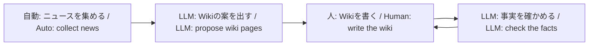

## 非公式であることの明示

本サイト（JAXA宇宙飛行士志望Wiki）は **JAXA・NASA・ESA 等の公式サイトではありません**。個人・コミュニティ向けの学習用静的サイトです。選抜応募や公式手続きは各機関の公式ページを参照してください。

## 四つの段階

## ニュースと Wiki

| | ニュース | Wiki |
| --- | --- | --- |
| 中身 | 公式フィードや公式 X の出来事 | 人が書く学習用の要約 |
| 出典 | 公式の配信・投稿を集める | 許可された公式 URL だけ |
| 読み方 | 新しい順だけでなく、計画・事業の時間の流れの中で読む | テーマごとに整理された正本 |
| LLM | 集め方の一部に使うことがある | 案と監査だけ。本文は書かない |

ニュースがきっかけになり、LLM が Wiki の案を出し、人が公式資料で書き、LLM が事実を確かめます。ニュースの文章を Wiki にコピーしません。報道は Wiki の出典にしません。

インタビューは JAXA / NASA 等の公式プロフィール、記者会見、公式チャンネルに限ります。全文転載はしません。

## 誰のためのサイトか

JAXA 宇宙飛行士を志望する人、日本の有人宇宙開発を公式一次資料から学びたい人向けです。応募窓口でも、速報メディアでもありません。

## Wiki を足す

1. 公式ページの URL を手元に置く（許可ドメイン以外は出典にしない）。
2. `src/content/docs/<slug>/` に Markdown を置く。新しいテーマならフォルダと `index.md`（日本語の `title`）を足す。テンプレートは `src/content/docs/_template/`。
3. 必須 frontmatter: `title`、`description`、`sources`（公式 URL の配列）、`reviewed`。
4. サイドバーとトップの案内はフォルダ走査で自動更新されます。

開発者向けの仕様は GitHub の [`docs/`](https://github.com/tetra4rnav/wannabe-jaxa-astronaut/tree/main/docs)（DOMAIN / GLOSSARY / REQ・ADR・VER）を参照してください。
